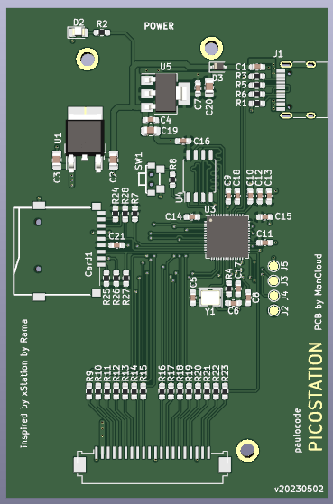
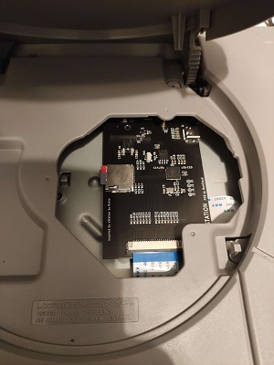

# picostation_pcb

 

This is my adaption of the PicoStation PCB for [paulocode](https://github.com/paulocode)s [PicoStation](https://github.com/paulocode/picostation).  
This layout was made to be completely purchaseable by JLCPCB therefore all partsnumbers etc. are included in the Project.

---

## ! WARNING ! 
The PCB seems to have a flaw which leads to code not being able to boot properly.
Neither the PicoStation nor a simple blink application is then able to be booted.

What we know so far:

 - it depends on the RP2040, switching the RP2040 may solve the issue 
 - the RP2040 is only unuseable on this board. If one swaps the RP2040 between e.g. this board and a RPi Pico, it will boot on the Pico board but won't on the PicoStation PCB.
 - the UF2 loader works without a problem. If you upload the UF2-file the board will work just fine until reset.
 - swapping the SPI-Flash does nothing  
 - adding a 10k Pull-Up to Chip-Select does nothing  

---

 - The FFC cable is the same one that comes with an Xstation
